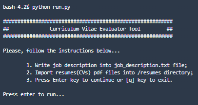

### Deep Learning - Applied Natural Language Processing & Computer Vision

# _Curriculum Vitae Matching Job Description_ 

### Project done by:
* José Cabral
* José Jesus
* Manuel Sousa

### Decription
This project was executed in order to apply deep learning techniques learned in classes and in a way mix them in a project format whose concept would enable to explore both areas of natural language processing and computer vision.
The work developed stands out as a program that selects the curriculum vitaes with the best match classification according to a job announcement description. Furthermore, the keywords present in the best resumes are analyzed and the faces of each candidate are detected in their own curriculum vitae.

### Before running, please install all required dependencies using the command on CMD console:
    pip install -r requirements.txt

### To run the program use the command:
    python run.py

### ...and is running on your CMD console!

### How to use the program:
1. Create necessary txt file named "job_description" and folder named "resumes". If they are not created before running the program, the program itself will create them for you;
1. Write a job description into job_description.txt file;
2. Import resumes(CVs) pdf files into /resumes directory;
3. Press Enter key to run the program logic or [q] key to exit;
4. The best scored resumes will be available in /results folder following the images of each candidates face detected;
5. In the CMD console the results summary will also be printed: resume name, algorithm matching score and relevant keywords found in resume.
